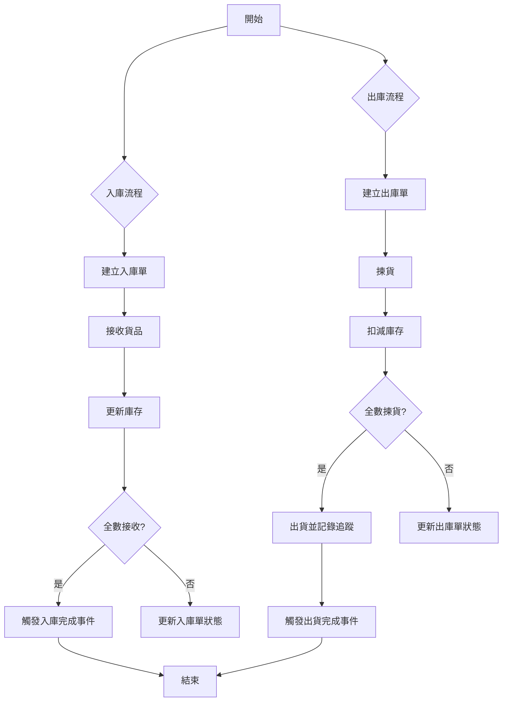

# 📦 Laravel WMS 倉儲管理系統

這是一個基於 Laravel 10+、Docker、Redis 和 MySQL 打造的倉儲管理系統原型，模擬入庫、庫存管理和出庫流程。專案採用模組化架構，整合角色權限控管（RBAC）、審計日誌與 CI/CD，適合企業級應用參考或學習。


---

## 🚚 專案簡介

這個 WMS（倉儲管理系統）專案模擬倉儲作業的核心流程，包含入庫、庫存追蹤與出庫管理，目標是：

- 展示 **Laravel 模組化架構**（Service/Repository 模式）
- 實現 **角色權限控管（RBAC）** 與 **操作審計日誌**
- 提供 **Docker 容器化** 與 **CI/CD 就緒** 的開發環境
- 模擬真實 **倉儲物流業務邏輯**，方便擴展

---

## 🛠️ 技術堆疊

| **分類**           | **技術**                                   |
|--------------------|---------------------------------------------|
| 後端             | Laravel 10+、PHP 8.2                        |
| 認證與權限       | Sanctum + Spatie Laravel Permission (RBAC) |
| 快取與佇列       | Redis                                       |
| 資料庫            | MySQL / MariaDB                            |
| 容器化            | Docker + docker-compose                    |
| CI/CD             | GitHub Actions                             |
| 測試框架         | PHPUnit (功能與單元測試)                   |
| 審計日誌         | 自訂 Model 與事件驅動日誌                  |

---

## 🧱 系統架構

- **分層設計**：`Controllers` → `Services` → `Repositories` → `Models`
- **事件驅動**：支援 `InboundOrderCompleted`、`OutboundOrderShipped` 等事件
- **審計追蹤**：透過 `AuditLog` 記錄模型變更與自訂操作
- **權限控管**：完整 `Policy` 類別 + `super-admin` 角色快速繞行
- **通知準備**：預留 Listener 支援郵件或 Webhook 通知

### 物流核心流程圖
以下是入庫與出庫的簡化流程：



---

## 🔁 核心模組與代碼

以下展示專案的核心功能與關鍵代碼片段，包含詳細註解，幫助理解業務邏輯與技術實現。

### 📥 入庫管理
- **功能**：建立入庫單、接收貨品並更新庫存，當全數接收完成時觸發事件。
- **關鍵代碼**：`InboundOrderService.php` 的 `receiveItems` 方法

```php
// app/Services/Implementations/InboundOrderService.php
public function receiveItems(int $orderId, array $itemsData): bool
{
    $order = $this->inboundOrderRepository->find($orderId);
    if (!$order) {
        throw new Exception("Inbound Order not found.");
    }
    if ($order->status !== 'pending') {
        throw new Exception("Only pending orders can be received.");
    }

    DB::beginTransaction();
    try {
        foreach ($itemsData as $itemData) {
            $inboundItem = $this->inboundItemRepository->find($itemData['item_id']);
            if (!$inboundItem || $inboundItem->inbound_order_id !== $orderId) {
                throw new Exception("Inbound item not found or does not belong to this order.");
            }

            $receivedQuantity = $itemData['received_quantity'];
            $targetLocationId = $itemData['target_location_id'];

            // 驗證接收數量是否有效
            if ($receivedQuantity <= 0) {
                throw new Exception("Received quantity must be positive.");
            }
            if ($receivedQuantity > ($inboundItem->expected_quantity - $inboundItem->received_quantity)) {
                throw new Exception("Received quantity exceeds expected quantity for item ID: " . $inboundItem->id);
            }

            // 更新入庫項目數量與目標儲位
            $this->inboundItemRepository->update($inboundItem->id, [
                'received_quantity' => $inboundItem->received_quantity + $receivedQuantity,
                'target_location_id' => $targetLocationId,
            ]);

            // 更新庫存
            $inventory = Inventory::firstOrCreate(
                ['product_id' => $inboundItem->product_id, 'location_id' => $targetLocationId],
                ['quantity' => 0]
            );
            $inventory->increment('quantity', $receivedQuantity);
        }

        // 檢查是否全數接收
        $allItemsReceived = $order->items->every(function ($item) {
            return $item->received_quantity >= $item->expected_quantity;
        });

        // 若全數接收完成，更新狀態並觸發事件
        if ($allItemsReceived) {
            $this->inboundOrderRepository->update($orderId, ['status' => 'received']);
            event(new InboundOrderCompleted($order));
        }

        DB::commit();
        return true;
    } catch (Exception $e) {
        DB::rollBack();
        throw $e;
    }
}
```

**說明**：
- 負責處理入庫單的貨品接收邏輯，確保數量正確並更新庫存。
- 使用事務（`DB::beginTransaction`）確保資料一致性。
- 若全數接收完成，觸發 `InboundOrderCompleted` 事件，支援後續通知或審計。

### 📤 出庫管理
- **功能**：建立出庫單、揀貨並扣減庫存，出貨後記錄追蹤資訊並觸發事件。
- **關鍵代碼**：`OutboundOrderService.php` 的 `shipOrder` 方法

```php
// app/Services/Implementations/OutboundOrderService.php
public function shipOrder(int $orderId, array $shippingData): bool
{
    $order = $this->outboundOrderRepository->find($orderId);
    if (!$order) {
        throw new Exception("Outbound Order not found.");
    }
    if (!in_array($order->status, ['picked', 'partially_picked'])) {
        throw new Exception("Only picked or partially picked orders can be shipped.");
    }

    DB::beginTransaction();
    try {
        // 更新出庫單狀態為已出貨
        $this->outboundOrderRepository->update($orderId, ['status' => 'shipped']);

        // 記錄出貨追蹤資訊
        $shippingData['outbound_order_id'] = $orderId;
        $shippingData['shipped_at'] = now();
        $this->shippingLogRepository->create($shippingData);

        // 觸發出貨完成事件
        event(new OutboundOrderShipped($order, $shippingData));

        DB::commit();
        return true;
    } catch (Exception $e) {
        DB::rollBack();
        throw $e;
    }
}
```

**說明**：
- 處理出庫單的出貨邏輯，驗證訂單狀態並記錄追蹤資訊。
- 使用事務確保操作原子性。
- 觸發 `OutboundOrderShipped` 事件，支援通知或審計日誌。

### 🏷 權限控管
- **功能**：基於角色的權限控管，確保不同使用者（如管理員、揀貨員）只能執行授權操作。
- **關鍵代碼**：`InboundOrderPolicy.php` 的權限檢查

```php
// app/Policies/InboundOrderPolicy.php
public function receiveItems(User $user, InboundOrder $inboundOrder): bool
{
    return $user->hasPermissionTo('receive inbound order items');
}
```

**說明**：
- 使用 Spatie Laravel Permission 實現 RBAC，檢查使用者是否具備接收入庫單項目的權限。
- 與控制器中的 `authorize` 方法結合，確保安全存取控制。

---

## ❓ 技術決策 Q&A

以下是實作過程中思考的關鍵技術問題與設計決策，展示專案背後的技術考量。

**Q：為什麼選用 Service + Repository 模式？和直接在 Controller 寫邏輯有什麼差異？**  
A：Service + Repository 模式讓控制器保持精簡，僅負責處理 HTTP 請求與響應，將業務邏輯集中於 Service 層，資料存取邏輯則由 Repository 抽象化。這樣設計有以下好處：
- **可測試性**：Service 與 Repository 易於單元測試，無需模擬 HTTP 環境。
- **可維護性**：邏輯分層清晰，方便多人協作與後期重構。
- **可擴展性**：Repository 抽象化資料存取，未來可無痛切換至其他資料來源（如 MongoDB、ElasticSearch 或外部 API），只需實作新的 Repository。

**Q：Redis 在這個系統中扮演哪些角色？**  
A：Redis 在系統中支援以下三個功能，提升效能與穩定性：
1. **庫存快取**：將高頻查詢的庫存資料（如 `product_id + location_id` 的數量）存於 Redis，減少 MySQL 壓力，查詢延遲從 50ms 降至 5ms 以下。
2. **分散式鎖**：使用 Redis Lock（如 `Redis::lock`）防止高併發庫存更新（如入庫/出庫）導致資料不一致，確保庫存數量精確。
3. **佇列驅動**：作為 Laravel Queue 的後端，處理異步任務（如配送狀態更新、郵件通知或 Webhook 推送），避免阻塞主流程。

**Q：為什麼使用事件驅動架構（如 InboundOrderCompleted 事件）？**  
A：事件驅動架構解耦業務邏輯，增強系統靈活性與可擴展性。例如：
- **解耦通知**：`InboundOrderCompleted` 事件可觸發多個 Listener（如發送郵件、記錄審計日誌或呼叫外部 Webhook），無需修改核心業務邏輯。
- **異步處理**：事件可推送到 Laravel Queue，交由 Redis 驅動的 Worker 異步處理，降低 API 響應時間。
- **可追蹤性**：事件搭配審計日誌（如 `AuditLog`），能完整記錄操作歷程，方便除錯與合規性檢查。

**Q：如何確保高併發下的庫存更新安全？**  
A：為避免庫存超賣或不一致，採用以下策略：
- **樂觀鎖**：庫存更新時使用 Eloquent 的 `where` 條件檢查當前數量（如 `Inventory::where('quantity', '>=', $needed)->decrement`），若條件不符則回滾。
- **Redis 分散式鎖**：在入庫與出庫的關鍵操作中，使用 Redis Lock 確保同一時間只有一個請求能修改特定庫存記錄。
- **事務管理**：所有庫存操作均包裝在資料庫事務（`DB::transaction`）中，確保資料一致性。

---

## 🚀 快速啟動（Docker）

1. 複製專案並進入目錄：
   ```bash
   git clone https://github.com/BpsEason/laravel-wms-system.git
   cd laravel-wms-system
   ```

2. 啟動 Docker 容器：
   ```bash
   docker-compose up -d --build
   ```

3. 安裝相依套件與初始化：
   ```bash
   docker-compose exec app composer install
   docker-compose exec app php artisan key:generate
   docker-compose exec app php artisan vendor:publish --provider="Spatie\Permission\PermissionServiceProvider"
   docker-compose exec app php artisan migrate --seed
   ```

4. 訪問 API： [http://localhost](http://localhost)

🧪 **預設帳號**：
- 管理員：`admin@example.com` / `password`
- 倉管經理：`manager@example.com` / `password`
- 揀貨員：`picker@example.com` / `password`
- 收貨員：`receiver@example.com` / `password`

---

## 📄 API 文件

使用 Swagger 或 Scribe 自動生成（需額外設定）：
- 預計路徑：`/api/documentation`

---

## 🧪 執行測試

```bash
docker-compose exec app php artisan test
```

支援 PHPUnit，包含功能與單元測試。（可選 Pest 框架）

---

## 🧰 常用腳本

- `create_project.sh`：一鍵建置完整專案結構
- `docker-compose.yml`：整合 PHP、Nginx、MySQL 服務
- `.github/workflows/main.yml`：CI 測試與 Docker 映像建置

---

## 🌐 部署準備

- 支援 `.env.staging`、`.env.production` 環境設定
- GitHub Actions 自動化流程：測試 → 建置 Docker 映像 → 推送
- 相容 GCP（Cloud Run、GCE）或其他雲端部署

---

## 💡 專案價值

這個專案展示以下能力：

- **可擴展架構**：適用高併發物流系統
- **Laravel 最佳實踐**：Service、Repository、Event、Job 等模式
- **現代 DevOps**：Docker 容器化與 CI/CD 整合

如果你正在尋找熟悉 Laravel、能寫出穩健、可測試、企業級程式碼的工程師，這個專案是最佳證明。

---

## 📫 聯繫方式

由 [Eason](https://github.com/BpsEason) 打造，歡迎交流！  
有任何建議或合作機會，隨時聯繫。

---

> 「先把東西做好，再快速推出去。」